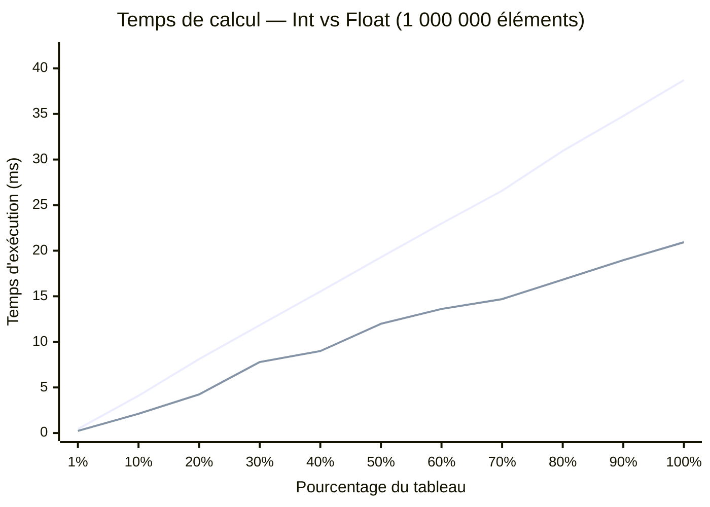

# Mesure et optimisation de la somme des sinus en Go

**Cours :** INF2007 – Programmation Avancée  
**Travail :** TN4  
**Étudiante :** Melissa Moya  
**Semaine :** 10  

---

## Approche et structure du programme

Le programme calcule la somme des sinus d'un tableau de 1 000 000 d'éléments, en entiers ou en flottants selon le flag `--type`. L'implémentation est organisée en trois parties. `generateIntArray` et `generateFloatArray` créent les tableaux avec `rand.NewSource(42)` afin que chaque exécution produise les mêmes données, ce qui garantit la reproductibilité des benchmarks. L'utilisation de `crypto/rand` aurait introduit un coût de génération non pertinent pour la mesure. Le biais potentiel de `rand.Intn(1001)` — possible pour les plages non puissances de deux, comme le décrit la méthode de Lemire (`toIntervalUnbiased`) — est négligeable pour le benchmarking : nous recherchons des données représentatives de la distribution générale des entiers, non une distribution parfaitement uniforme. `computeSineSumInt` et `computeSineSumFloat` contiennent la boucle de calcul spécialisée pour chaque type, et `computeSineSum` effectue le dispatch via un `switch` sur la valeur reçue en `interface{}`. Les benchmarks passent par `computeSineSum` afin de mesurer le programme dans sa forme d'exécution réelle, dispatch inclus. Le surcoût du `switch` et de l'assertion de type reste faible par rapport à `math.Sin`, mais ce choix rend la mesure plus représentative.

*Pour les résultats complets des tests, benchmarks et captures d'écran, voir le dossier [Results-and-Instructions](Results-and-Instructions/).*

## Résultats des benchmarks

Les mesures reposent sur `testing.B`, l'outil adapté au benchmarking en Go. Les `time.Since` dans `main` ne servent qu'à fournir une indication à l'utilisateur et ne sont pas utilisées pour l'analyse. `testing.B` ajuste automatiquement le nombre d'itérations (`b.N`) pour stabiliser la mesure, et `b.ResetTimer()` est appelé avant chaque boucle afin d'exclure le coût du setup. Les 22 sous-benchmarks (11 paliers par type) ont été exécutés avec `go test -bench=. -benchmem -count=6` sur un Intel i5-10300H à 2.50 GHz sous Windows/amd64 avec 8 threads, puis analysés avec `benchstat` pour obtenir les médianes et les intervalles de confiance à 95 %. Le résultat à `0 B/op` montre qu'aucune allocation mémoire significative n'apparaît dans le chemin mesuré. Le fichier de test contient 13 tests unitaires et atteint une couverture de 100 %. En complément des 3 tests demandés, des tests ont été ajoutés pour les valeurs négatives, les flottants extrêmes (`1e15`), le dispatch avec des données incompatibles, la fonction `run` pour chaque type, et `main` elle-même.

### Méthode expérimentale

Cette étude s'appuie sur `testing.B`, qui répète automatiquement l'opération via `b.N` jusqu'à obtenir une mesure stable, puis présente les résultats en `ns/op` et `B/op`. L'appel à `b.ReportAllocs()` rend visible le coût mémoire, et les résultats à `0 B/op` indiquent que la différence de performance provient surtout du calcul et de l'accès séquentiel au tableau, plutôt que d'allocations cachées. Comme les tableaux sont parcourus linéairement, l'accès reste favorable au cache; lorsque la taille augmente, l'effet de la hiérarchie mémoire devient plus visible. Enfin, l'utilisation de `rand.NewSource(42)` rend les données reproductibles, ce qui permet de comparer les benchmarks d'une exécution à l'autre dans des conditions cohérentes.

**Tableau 1 – Temps de calcul par type et pourcentage du tableau (1 000 000 éléments)**

| % du tableau | Éléments | Int (ms) | Float (ms) | Ratio |
|:---:|:---:|:---:|:---:|:---:|
| 1 % | 10 000 | 0.44 | 0.24 | 1.86× |
| 10 % | 100 000 | 4.09 | 2.11 | 1.94× |
| 20 % | 200 000 | 8.11 | 4.24 | 1.91× |
| 30 % | 300 000 | 11.83 | 7.79 | 1.52× |
| 40 % | 400 000 | 15.52 | 8.99 | 1.73× |
| 50 % | 500 000 | 19.28 | 11.98 | 1.61× |
| 60 % | 600 000 | 22.98 | 13.61 | 1.69× |
| 70 % | 700 000 | 26.58 | 14.69 | 1.81× |
| 80 % | 800 000 | 30.94 | 16.82 | 1.84× |
| 90 % | 900 000 | 34.78 | 18.96 | 1.83× |
| 100 % | 1 000 000 | 38.71 | 20.93 | 1.85× |

Les flottants sont systématiquement plus rapides avec un ratio d'environ 1.5 à 1.9×. En passant de 50 % à 100 %, le temps double presque exactement (19.28 vers 38.71 ms pour Int, 11.98 vers 20.93 ms), ce qui confirme la complexité O(n). Les valeurs proviennent des médianes `benchstat` sur 6 exécutions, avec des intervalles de confiance de ± 1 % pour les paliers les plus longs (90–100 %). Aucune allocation mémoire n'a été détectée (0 B/op). Ces résultats servent de base à l'analyse qui suit.

**Graphique 1 – Temps de calcul selon le pourcentage du tableau (Int vs Float)**

> **Courbe du haut (mauve claire)** — Int (entiers, avec conversion `float64`)  
> **Courbe du bas (mauve foncée)** — Float (flottants, sans conversion)

*Pour la méthode de construction du graphique, voir [Guide-creation-graphique-Mermaid.md](Results-and-Instructions/Guide-creation-graphique-Mermaid.md).* 

La courbe Int progresse de façon quasi linéaire, tandis que la courbe Float présente de légères irrégularités (notamment aux paliers 30 % et 70 %). Les deux séries restent compatibles avec une complexité linéaire, et ces écarts s'expliquent surtout par le bruit de mesure : les benchmarks Float étant plus rapides, une même perturbation (interruption système, variation de fréquence, effet thermique) a un impact relatif plus visible. Les intervalles de confiance `benchstat` le confirment : Float/30pct affiche ± 7 % contre ± 1 % pour Int/100pct. Une cause structurelle est également plausible : le palier 30 % correspond à 300 000 éléments, soit ~2.3 MB pour `[]int` et ~2.4 MB pour `[]float64`. Cette taille dépasse la capacité typique d'un cache L2 (~256–512 KB sur l'i5-10300H) mais reste sous celle du L3 (~8 MB). De plus, le tableau complet à 100 % (1 000 000 éléments × 8 octets = **8 MB**) correspond exactement à la taille du L3 sur cet i5-10300H (L1 = 256 KB, L2 = 1 MB, L3 = 8 MB). Les accès à pleine taille sont donc limités par la bande passante vers le L3, tandis que les petits paliers (1–10 %) tiennent entièrement en L2. C'est ce gradient de hiérarchie mémoire qui explique les légères non-linéarités observées aux paliers 70 %+ : à mesure que la taille du tableau dépasse L1 puis L2, la latence mémoire croît par paliers, et non de façon parfaitement proportionnelle au nombre d'éléments. La transition L2→L3 est donc active à ce palier, et comme les benchmarks Float sont plus courts, la latence mémoire représente une fraction relative plus importante de leur temps total — ce qui amplifie la variabilité observée. L'écart entre Int et Float s'explique par la conversion `float64(v)` effectuée à chaque itération. Cette conversion ajoute un coût supplémentaire, mais la différence observée reflète surtout le coût global de la boucle et de `math.Sin`, plutôt qu'un seul effet isolé.

En pratique, les courbes ne reflètent pas seulement le coût de `math.Sin`. Quand le tableau grossit, une plus grande partie des données sort des caches L1 et L2, puis L3, ce qui rend la composante mémoire plus visible. Il est donc nécessaire de commenter la forme de la courbe, et pas seulement une valeur moyenne : le calcul reste séquentiel et favorable au cache, mais les grandes tailles tendent à être davantage influencées par la hiérarchie mémoire et la bande passante.

### Précision des flottants et représentabilité des types

Le type de données influence non seulement la vitesse d'exécution, mais aussi la précision numérique et le comportement de `math.Sin`. Un entier dans [0, 1000] est exactement représentable en `float64` — la mantisse de 53 bits peut représenter sans erreur tout entier jusqu'à $2^{53} \approx 9 \times 10^{15}$, donc la conversion `float64(v)` pour des valeurs ≤ 1000 n'introduit aucune perte de précision. En revanche, pour les entiers, `math.Sin(500)` nécessite de réduire 500 modulo $2\pi \approx 6.28$, soit environ 79 tours complets avant le calcul principal. Cette réduction d'argument nécessite des étapes de calcul supplémentaires, contrairement aux flottants dans [0, 1) qui se situent déjà dans le domaine principal de `sin()` et ne requièrent aucune réduction. Pour les `float64` dans [0, 1), les valeurs sont continûment distribuées sur l'intervalle réel et chaque appel à `math.Sin` est donc légèrement plus direct. Cette différence de comportement de la FPU contribue, en plus de la conversion de type, à l'écart de performance observé entre les deux séries.

### Mécanismes micro-architecturaux (ch. 6)

**Inlining de `math.Sin`.** La commande `go build -gcflags=-m` confirme que le compilateur Go intègre directement l'appel à `math.Sin` dans la boucle de calcul (`inlining call to math.Sin` aux lignes 40 et 49 de `sinesum.go`). Cet inlining élimine le surcoût d'appel de fonction (sauvegarde des registres, changement de frame de pile). Contrairement à l'hypothèse initiale selon laquelle `math.Sin` serait trop complexe pour être inliné, le compilateur Go 1.21+ réussit à l'intégrer, ce qui rend le coût par itération strictement déterministe : il n'y a pas de pénalité d'appel variable qui aurait pu perturber les mesures.

**Dépendance de données et superscalarité.** La boucle `sum += math.Sin(v)` crée une chaîne de dépendances de données séquentielles : chaque addition doit attendre le résultat de la précédente avant de s'exécuter. Ce schéma est identique à l'exemple `prefixSum` du chapitre 6, qui illustre comment la dépendance sur l'accumulateur empêche le processeur d'exécuter plusieurs additions en parallèle (parallélisme intra-instruction). Il est important de préciser que la dépendance de données s'applique spécifiquement à l'accumulateur `sum` — les calculs de `math.Sin(v)` successifs pour des valeurs `v` différentes sont indépendants entre eux et peuvent en principe être mis en pipeline par le processeur superscalaire (exécution dans le désordre), bien que ce bénéfice soit limité par la latence intrinsèque de `math.Sin` elle-même. Le pipeline superscalaire de l'i5-10300H ne peut donc pas paralléliser les additions sur `sum`, ce qui constitue une limite supérieure à l'optimisation possible sans restructurer la boucle — par exemple avec plusieurs accumulateurs indépendants fusionnés en fin de calcul.

## Applications numériques

Les benchmarks à 100 % du tableau donnent le temps moyen par appel à `math.Sin`. La médiane `benchstat` du benchmark Int est de 38 710 000 ns/op pour 1 000 000 d'éléments, soit $38\,710\,000 \div 1\,000\,000 = 38.7$ ns par sinus. La médiane Float est de 20 930 000 ns/op, soit $20\,930\,000 \div 1\,000\,000 = 20.9$ ns par sinus. Ces deux valeurs servent de base aux questions suivantes.

**Question 1 – Quelle distance parcourt la lumière pendant le calcul d'un sinus ?**

La vitesse de la lumière est $c = 299\,792\,458$ m/s. On multiplie par le temps d'un sinus converti en secondes.

$$d_{int} = 299\,792\,458 \times \frac{38.7}{1\,000\,000\,000} = 11.6 \text{ mètres}$$

$$d_{float} = 299\,792\,458 \times \frac{20.9}{1\,000\,000\,000} = 6.3 \text{ mètres}$$

**Réponse.** La lumière parcourt entre 6 et 12 mètres pendant un seul calcul de sinus.

**Question 2 – Combien de sinus peut-on calculer par tick à 120 fps ?**

Un tick à 120 fps dure $\frac{1}{120} = 8\,333\,333$ ns. On divise par le temps d'un sinus.

$$n_{int} = \frac{8\,333\,333}{38.7} \approx 215\,333 \text{ sinus par tick}$$

$$n_{float} = \frac{8\,333\,333}{20.9} \approx 398\,726 \text{ sinus par tick}$$

**Réponse.** On peut calculer environ 215 000 sinus (Int) ou 399 000 sinus (Float) par tick. En pratique, si une partie du budget de frame doit être conservée pour le rendu et le reste du moteur, ces valeurs donnent une marge confortable pour des effets visuels simples.

*Pour les détails de chaque calcul, voir [Guide-applications-numeriques.md](Results-and-Instructions/Guide-applications-numeriques.md).*

## Conclusion

Ce travail démontre que le choix du type de données a un impact direct et mesurable sur les performances en Go. Les flottants (`float64`) s'avèrent environ 1.85× plus rapides que les entiers pour le même calcul de sinus, principalement parce que la conversion `float64(v)` à chaque itération ajoute un coût non négligeable sur 1 000 000 d'appels. La complexité est O(n) pour les deux types, ce que confirment les courbes quasi linéaires des benchmarks. Aucune allocation mémoire n'a été détectée (0 B/op), ce qui signifie que la performance est entièrement liée au calcul et à l'accès séquentiel au tableau.

L'utilisation de `testing.B` avec `benchstat` sur 6 exécutions permet d'obtenir des médianes fiables avec des intervalles de confiance à 95 %, une méthode bien supérieure à une mesure manuelle par `time.Since`. Ces résultats montrent qu'une opération courante comme `math.Sin` a un coût de l'ordre de 20–40 ns, soit suffisamment bas pour permettre plusieurs centaines de milliers d'appels par frame à 120 fps. La vérification avec `go build -gcflags=-m` révèle que `math.Sin` est inliné par le compilateur, ce qui élimine tout surcoût d'appel et rend les mesures encore plus représentatives du pur coût de calcul.

Au final, même une opération mathématique courante comme `math.Sin` a un coût mesurable à l'échelle du processeur, et ce travail permet de le quantifier de manière reproductible.

### Liens

- Dépôt GitHub [github.com/moyamelissa/Advanced-Programming/tree/main/TN4](https://github.com/moyamelissa/Advanced-Programming/tree/main/TN4)
- Implémentation [sinesum.go](sinesum.go)
- Tests et benchmarks [sinesum_test.go](sinesum_test.go)

### Bibliographie

- Documentation Go `math/rand`, `testing`, `flag` sur https://pkg.go.dev
- Documentation Mermaid XY Chart https://mermaid.js.org/syntax/xyChart.html
- Lemire, D. (2019). *Fast random integer generation in an interval*. ACM Transactions on Modeling and Computer Simulation — biais de `rand.Intn` pour les plages non puissances de deux
- GitHub Copilot, utilisé comme assistant avec vérification systématique des suggestions
