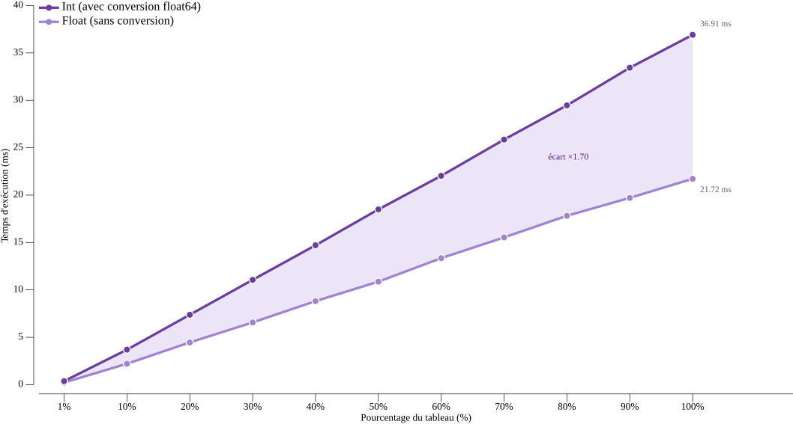

# Mesure et optimisation de la somme des sinus en Go

**INF2007 – Programmation Avancée · TN4 · Melissa Moya**

---

## 1. Approche

Le programme accepte un paramètre `--type` pour choisir entre entiers et flottants
et génère un tableau de 1 000 000 d'éléments avec `rand.NewSource(42)` pour la
reproductibilité. Deux fonctions spécialisées, `computeSineSumInt` et
`computeSineSumFloat`, isolent la boucle de calcul par type afin que les benchmarks
mesurent uniquement le coût de `math.Sin`. La logique est contenue dans `run()`,
qui retourne un struct `RunResult` sans affichage, ce qui facilite les tests
unitaires.

## 2. Résultats des benchmarks

Les 22 sous-benchmarks (11 paliers × 2 types) ont été exécutés avec
`go test -bench=. -benchmem -count=6` sur un Intel i5-10300H à 2,50 GHz
(Windows/amd64) et analysés avec `benchstat`. Les tableaux sont pré-générés hors
de `b.N`, `b.ResetTimer()` exclut le setup, et `b.ReportAllocs()` confirme 0 B/op
et 0 allocs/op pour les deux types.

**Tableau 1 – Temps de calcul par type et pourcentage du tableau**

| % du tableau | Éléments | Int (ms) | Float (ms) | Ratio |
|:---:|:---:|:---:|:---:|:---:|
| 1 % | 10 000 | 0.396 | 0.206 | 1.92× |
| 10 % | 100 000 | 3.57 | 2.06 | 1.73× |
| 20 % | 200 000 | 7.12 | 4.16 | 1.71× |
| 30 % | 300 000 | 10.74 | 6.31 | 1.70× |
| 40 % | 400 000 | 14.31 | 8.53 | 1.68× |
| 50 % | 500 000 | 17.90 | 11.43 | 1.57× |
| 60 % | 600 000 | 21.41 | 13.82 | 1.55× |
| 70 % | 700 000 | 25.11 | 15.28 | 1.64× |
| 80 % | 800 000 | 28.65 | 17.66 | 1.62× |
| 90 % | 900 000 | 32.29 | 22.52 | 1.43× |
| 100 % | 1 000 000 | 35.76 | 22.64 | 1.58× |

**Graphique 1 – Temps de calcul selon le pourcentage du tableau (Int vs Float)**

## 3. Analyse

Les flottants sont 1,4 à 1,9× plus rapides. L'écart vient de la conversion
`float64(v)` à chaque itération, qui génère l'instruction CPU `CVTSI2SD`
(Convert Scalar Integer to Scalar Double) absente du chemin Float, ainsi que du
coût de réduction d'argument de `math.Sin` pour les grands entiers. sin(500)
nécessite environ 79 réductions modulo 2π, alors que les flottants dans [0, 1)
sont déjà dans le domaine principal. De 50 % à 100 %, le temps double presque
exactement pour les entiers (17,90 à 35,76 ms), confirmant la complexité O(n).

La hiérarchie mémoire de l'i5-10300H explique le comportement aux grands paliers.
Avec 256 KB de L1, 1 MB de L2 et 8 MB de L3, les petits paliers (1 à 10 %, 80 à
800 KB) tiennent en L2. À partir de 30 % (2,4 MB), le L3 prend le relais. À 90 %
(7,2 MB), le tableau approche la limite du L3 et les paliers 90 % et 100 %
affichent des temps quasi identiques pour Float (22,52 vs 22,64 ms, confirmés
par rerun isolé), signe d'une saturation de la bande passante L3.

`go build -gcflags=-m` confirme que `math.Sin` est inliné dans `sinesum.go`.
La boucle `sum += math.Sin(v)` crée une dépendance de données sur l'accumulateur,
ce qui empêche le pipeline FPU de superposer les additions, comme dans l'exemple
`prefixSum` du chapitre 6. Les appels `math.Sin(v)` bénéficient de l'exécution
dans le désordre mais sont plafonnés par la latence intrinsèque de `math.Sin`.
Les paliers Float, plus courts, sont sensibles au bruit lors d'exécutions
séquentielles, et un rerun isolé des paliers 70 % à 100 % a confirmé les valeurs
du tableau. Utiliser plusieurs accumulateurs fusionnés en fin de calcul réduirait
la dépendance de données et constituerait la principale piste d'optimisation.

## 4. Applications numériques

Les médianes benchstat à 100 % donnent 35,8 ns par sinus pour les entiers et
22,6 ns pour les flottants.

**Q1 — Distance parcourue par la lumière pendant un sinus** ($c = 299\,792\,458$ m/s)

| Type | Temps | Distance |
|:---:|:---:|:---:|
| Int | 35,8 ns | $299\,792\,458 \times \frac{35{,}8}{10^9} \approx$ **10,7 m** |
| Float | 22,6 ns | $299\,792\,458 \times \frac{22{,}6}{10^9} \approx$ **6,8 m** |

**Q2 — Nombre de sinus par tick à 120 fps** (tick = 8 333 333 ns)

| Type | Temps/sinus | Sinus/tick |
|:---:|:---:|:---:|
| Int | 35,8 ns | $8\,333\,333 \div 35{,}8 \approx$ **233 000** |
| Float | 22,6 ns | $8\,333\,333 \div 22{,}6 \approx$ **369 000** |

### Bibliographie

- Manuel INF2007, chapitre 6.
- Documentation Go gonum/plot v0.14.0 : https://pkg.go.dev/gonum.org/v1/plot
- Documentation Go Testing : https://pkg.go.dev/testing
