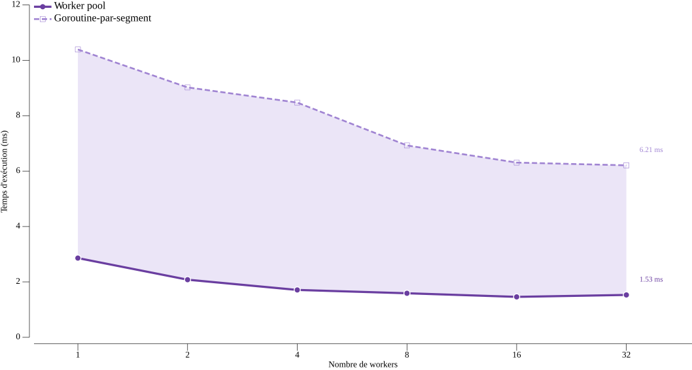

# Comptage concurrent de mots en Go

**INF2007 – Programmation Avancée · TN5 · Melissa Moya**

---

## 1. Architecture concurrente

Le point de départ est une contrainte de l'énoncé. Un segment découpé à
exactement N caractères risque de couper un mot en deux, faussant le compte.
Pour éviter ce problème, `splitIntoSegments` avance la coupure caractère par
caractère jusqu'au prochain espace blanc, garantissant que chaque segment
contient des mots complets. Cette décision architecturale est préalable à toute
concurrence, car elle assure que chaque goroutine peut compter ses mots de façon
totalement indépendante sans coordination.

Une fois les segments établis, une goroutine est lancée par segment avec
`go countWordsInSegment`. Chaque goroutine calcule un total local dans une
variable de pile, puis envoie ce résultat sur un canal partagé (`chan int`).
La goroutine principale collecte ensuite tous les résultats et les somme.

Trois propriétés du canal et du programme garantissent l'exactitude du résultat
sans recourir à un mutex. Premièrement, aucune variable n'est partagée entre
les goroutines. Chaque goroutine opère sur son propre segment et n'écrit que
sur le canal, ce qui élimine toute condition de course. Deuxièmement, le canal
est en mémoire tampon avec une capacité égale au nombre de segments, de sorte
que chaque envoi aboutit immédiatement sans bloquer la goroutine expéditrice,
quelle que soit la vitesse de la goroutine principale. Troisièmement, la boucle
`for range segments` consomme exactement N résultats avant de retourner, ce qui
constitue une synchronisation implicite. La goroutine principale ne peut pas
terminer avant que toutes les goroutines aient envoyé leur résultat. L'addition
étant commutative, l'ordre d'arrivée des résultats n'affecte pas le total final.

## 2. Démarche de mesure et résultats

Les mesures ont été effectuées sur un Intel i5-10300H à 2,50 GHz (4 cœurs
physiques et 8 threads logiques, Windows/amd64) avec un contenu de test de
100 000 mots (~700 000 caractères). Chaque configuration a été exécutée 6 fois
avec `go test -bench=. -count=6` et analysée avec `benchstat` pour obtenir la
médiane et l'intervalle de confiance à 95 %. Le contenu de test est pré-généré
comme variable de paquet, hors de la boucle `b.N`, ce qui exclut l'initialisation
du temps mesuré conformément aux recommandations du chapitre 6.

**Tableau 1 – Temps selon la taille des segments (CountWordsConcurrent)**

| Segment | 500 | 1 000 | 5 000 | 10 000 | 50 000 | 100 000 | Tout |
|:---:|:---:|:---:|:---:|:---:|:---:|:---:|:---:|
| Temps (ms) | 8.87 | 2.84 | 4.84 | 4.85 | **1.78** | 1.97 | 4.09 |

Le résultat révèle un comportement en U. Avec des segments trop petits (500
caractères, soit environ 1 200 goroutines), le coût de création et
d'ordonnancement des goroutines dépasse le bénéfice du parallélisme et la
performance devient pire que le séquentiel (5.08 ms). À 50 000 caractères on
atteint l'optimum à 1.78 ms, soit un gain de 2.85× sur le séquentiel.
Au-delà, les segments deviennent si grands que le parallélisme disparaît et on
retrouve un comportement quasi-séquentiel.

## 3. Analyse de la linéarité et worker pool

Pour répondre à la question de la linéarité, `CountWordsConcurrentN` contrôle
directement le nombre de goroutines en calculant une taille de segment
proportionnelle. Cela permet d'isoler l'effet du nombre de goroutines
indépendamment de la taille des segments.

**Tableau 2 – Temps selon le nombre de goroutines (CountWordsConcurrentN)**

| Workers | 1 | 2 | 4 | 8 | 16 | 32 |
|:---:|:---:|:---:|:---:|:---:|:---:|:---:|
| Temps (ms) | 10.39 | 9.02 | 8.47 | 6.93 | 6.31 | 6.21 |
| Accélération | 1.00× | 1.15× | 1.23× | 1.50× | 1.65× | 1.67× |

La progression est clairement sous-linéaire. Sur 4 cœurs physiques, l'accélération
plafonne à 1.67× au lieu des 4× théoriques. L'explication tient à la nature du
travail. `strings.Fields` effectue un seul balayage linéaire très rapide, si
bien que le temps de calcul par goroutine est trop court pour amortir les coûts
fixes de création, d'ordonnancement et de synchronisation via le canal. En
appliquant la loi d'Amdahl au speedup maximum observé (1.67×), on déduit que
seulement 40 % du travail est parallélisable et 60 % reste séquentiel de façon
inhérente, ce qui inclut la lecture du fichier, le découpage et la sommation
finale.

Face à ce constat, une deuxième approche a été explorée. Plutôt que de créer
une nouvelle goroutine par segment à chaque appel, `CountWordsConcurrentPool`
maintient un pool fixe de `numWorkers` goroutines persistantes qui lisent les
segments depuis un canal de jobs via `for seg := range jobs`. La fermeture du
canal avec `close(jobs)` signale proprement la fin du travail à tous les workers
simultanément, sans coordination explicite supplémentaire. Cette architecture élimine
la recréation répétée des goroutines et fixe la taille des segments à 50 000
caractères, soit l'optimum identifié au Tableau 1.

**Tableau 3 – Worker pool vs goroutine-par-segment**

| Workers | 1 | 2 | 4 | 8 | 16 | 32 |
|:---:|:---:|:---:|:---:|:---:|:---:|:---:|
| Pool (ms) | 2.86 | 2.08 | 1.71 | 1.59 | **1.46** | 1.53 |
| Par-segment (ms) | 10.39 | 9.02 | 8.47 | 6.93 | 6.31 | 6.21 |
| Gain pool | 3.6× | 4.3× | 5.0× | 4.4× | 4.3× | 4.1× |

**Graphique 1 – Worker pool vs goroutine-par-segment selon le nombre de workers**

Le pool est 4 à 5× plus rapide que l'approche par segment à nombre de workers
égal. La différence vient du fait que `CountWordsConcurrentN` avec 1 worker
produit un seul segment de 700 000 caractères, comportement quasi-séquentiel,
tandis que le pool fixe toujours la taille à 50 000 caractères, soit environ
14 segments distribués au worker unique. Le pool améliore également la fraction
parallélisable. En appliquant Amdahl au speedup maximal du pool (1.96× de 1 à
16 workers), on obtient 52 % de travail parallélisable contre 40 % pour
l'approche naïve. Le plateau dès 16 workers persiste néanmoins, car la bande
passante mémoire et la contention sur le canal de résultats constituent un
plafond indépendant de la stratégie de création des goroutines.

### Bibliographie
- Manuel INF2007, chapitre 8.
- Documentation Go : https://pkg.go.dev/sync, https://pkg.go.dev/testing
- Calculs détaillés : docs/TN5-Calculs.md
