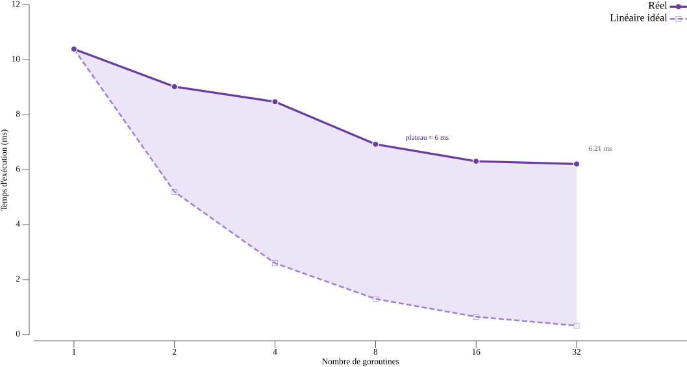

# Comptage concurrent de mots en Go

**INF2007 – Programmation Avancée · TN5 · Melissa Moya**

---

## 1. Architecture concurrente

Le programme divise le contenu du fichier en segments de taille paramétrable via `splitIntoSegments`, qui décale chaque coupure vers le prochain espace pour ne jamais couper un mot. Une goroutine est lancée par segment avec `go countWordsInSegment`, et chaque goroutine envoie son résultat partiel sur un canal partagé (`chan int`). Une variante `CountWordsConcurrentN` permet en outre de fixer explicitement le nombre de goroutines, ce qui sert à mesurer la linéarité du gain de performance.

La correction de l'exécution concurrente repose sur trois mécanismes. D'abord, aucune variable n'est partagée entre les goroutines. Chaque goroutine calcule son total local dans une variable de pile, puis l'envoie sur le canal, ce qui élimine toute condition de course sans mutex. Ensuite, le canal est en mémoire tampon avec une capacité égale au nombre de segments, donc tous les envois aboutissent sans blocage. Enfin, la boucle `for range segments` dans la goroutine principale consomme exactement N résultats avant de retourner, ce qui garantit que toutes les goroutines ont terminé avant la sommation finale. L'addition étant commutative, l'ordre d'arrivée n'affecte pas le résultat.

## 2. Résultats des benchmarks

Les mesures ont été effectuées sur un Intel i5-10300H à 2,50 GHz (4 cœurs
physiques et 8 threads logiques, Windows/amd64) avec un fichier de test d'environ
700 000 caractères (100 000 mots). Chaque configuration a été lancée 6 fois avec
`go test -bench=. -count=6` puis analysée avec `benchstat` pour obtenir la médiane
et l'intervalle de confiance à 95 %. `b.ResetTimer()` exclut l'initialisation et
`b.ReportAllocs()` rapporte les allocations mémoire.

**Graphique 1 – Passage à l'échelle réel vs linéaire idéal selon le nombre de goroutines**

Le graphique compare la courbe réelle (pleine) au passage à l'échelle linéaire idéal
(pointillée) qu'on obtiendrait si chaque goroutine ajoutée doublait la vitesse.
La zone violette mesure la perte de performance par rapport à cet idéal. Elle se
creuse à mesure que le nombre de goroutines augmente, et la courbe réelle atteint un
plateau autour de 6 ms dès 16 goroutines.

**Tableau 1 – Temps selon la taille des segments**

| Segment | 500 | 1 000 | 5 000 | 10 000 | 50 000 | 100 000 | Tout |
|:---:|:---:|:---:|:---:|:---:|:---:|:---:|:---:|
| Temps (ms) | 8.87 | 2.84 | 4.84 | 4.85 | **1.78** | 1.97 | 4.09 |

Le comptage séquentiel de référence prend 5.08 ms. Le concurrent atteint un
optimum à 50 000 caractères (1.78 ms), soit un gain de 2.85× sur le séquentiel.
Avec des segments trop petits (500 caractères, environ 1 200 goroutines),
la surcharge d'ordonnancement dépasse le bénéfice du parallélisme et la performance
devient pire que le séquentiel.

**Tableau 2 – Temps selon le nombre de goroutines (`CountWordsConcurrentN`)**

| Workers | 1 | 2 | 4 | 8 | 16 | 32 |
|:---:|:---:|:---:|:---:|:---:|:---:|:---:|
| Temps (ms) | 10.39 | 9.02 | 8.47 | 6.93 | 6.31 | 6.21 |
| Accélération | 1.00× | 1.15× | 1.23× | 1.50× | 1.65× | 1.67× |

Le passage de 1 à 8 workers réduit le temps de 33 % (10.39 à 6.93 ms), mais le
gain devient marginal au-delà. Doubler le nombre de goroutines de 16 à 32
n'économise que 0.1 ms supplémentaire. Cette stagnation confirme visuellement le
plateau observé sur le graphique et appelle l'analyse théorique de la section
suivante.

## 3. Analyse de la linéarité

La performance ne croît pas linéairement avec le nombre de goroutines. Sur
4 cœurs physiques, l'accélération mesurée atteint 1.67× au lieu des 4× théoriques et
plafonne dès 16 workers. Quatre facteurs expliquent cet écart. D'abord,
`strings.Fields` est une opération séquentielle rapide (un seul balayage du
segment), donc le travail par goroutine est trop court pour amortir le coût de
création et d'orchestration. Ensuite, le canal partagé crée un point de contention
à la collecte des résultats.

La pression mémoire amplifie cette surcharge puisque les allocations passent de 1/op en
séquentiel à 71 pour 32 workers et jusqu'à 2 700 pour des segments de 500
caractères, chaque goroutine allouant sa pile et son entrée sur le canal. Enfin,
la loi d'Amdahl s'applique puisque la lecture du fichier, le découpage et la
sommation finale restent séquentiels. Appliquée au speedup maximum observé (1.67×),
elle indique qu'environ 40 % du travail est parallélisable et 60 % intrinsèquement
séquentiel. Pour cette charge de travail, le segment optimal reste 50 000 caractères, qui
équilibre parallélisme et surcharge.

### Bibliographie
- Manuel INF2007, chapitre 8.
- Documentation Go : https://pkg.go.dev/sync, https://pkg.go.dev/testing
