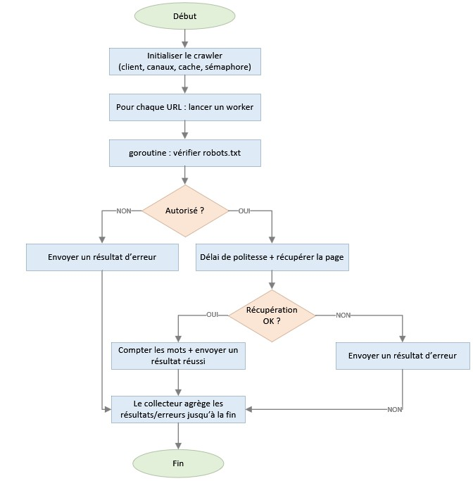
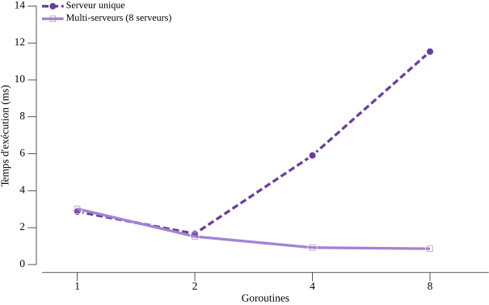

# TN6 – Robot d'exploration Web concurrent

**INF2007 – Programmation Avancée · TN6 · Melissa Moya**

---

## 1. Implémentation

### 1.1 Architecture générale

Le programme repose sur neuf fonctions à responsabilité unique, qui
propagent les erreurs explicitement plutôt que de paniquer. Cette conception
garantit qu'une URL défaillante n'interrompt pas l'exploration des autres, qu'il
s'agisse d'un timeout HTTP, d'un code de statut non-200, d'une lecture interrompue
ou d'une URL malformée. `CrawlURLs` orchestre l'exploration concurrente en lançant
une goroutine par URL, bornée par un sémaphore. La logique principale est extraite
dans `run()` pour permettre les tests unitaires sans modifier le comportement en
production. La figure 1 illustre le flux d'exécution complet pour une URL, des deux
points de décision jusqu'à l'agrégation des résultats par le consommateur unique.

**Figure 1 – Flux d'exécution de crawlURL()**



### 1.2 Gestion de la concurrence

`CrawlURLs` combine le patron producteur-consommateur via canal et la
synchronisation par mutex, conformément à la consigne du cours. Les goroutines
publient leur `CrawlResult` dans un canal bufferisé (`resultsCh`). Après
`wg.Wait()` et `close(resultsCh)`, un consommateur unique lit chaque résultat et
verrouille un `sync.Mutex` pour mettre à jour `totalWords`, `results` et `errs`,
respectant ainsi la synchronisation par mutex requise au Chapitre 8.

```go
resultsCh := make(chan CrawlResult, len(urls))

// Goroutines productrices :
resultsCh <- crawlURL(targetURL, client, robotsCache, &cacheMu)

// Consommateur unique (après wg.Wait + close) :
for result := range resultsCh {
    mu.Lock()
    if result.Err != nil {
        errs = append(errs, result.Err)
    } else {
        results[result.URL] = result.WordCount
        totalWords += result.WordCount
    }
    mu.Unlock()
}
```

Un `sync.RWMutex` distinct protège le cache `robots.txt` par hôte, où plusieurs
goroutines lisent et écrivent simultanément. Le patron de double vérification
(lecture partagée, puis écriture exclusive en cas de défaut) évite les requêtes
redondantes sans bloquer les lectures concurrentes.

```go
cacheMu.RLock()
r, found := cache[host]
cacheMu.RUnlock()

if !found {
    r = fetchRobots(parsed.Scheme, host, client)
    cacheMu.Lock()
    if _, alreadyCached := cache[host]; !alreadyCached {
        cache[host] = r
    } else {
        r = cache[host]
    }
    cacheMu.Unlock()
}
```

Le parallélisme est borné par un sémaphore (canal bufferisé de capacité
`maxGoroutines`). Chaque goroutine acquiert un jeton au démarrage et le libère
via `defer`.

### 1.3 Respect de robots.txt

`checkRobotsAllowed()` délègue à `fetchRobots()`, qui retourne `nil` si le fichier
est absent ou inaccessible. L'exploration est autorisée par défaut (RFC 9309). Les
résultats sont mis en cache par hôte. Un délai de politesse de 100 ms
(`politenessDelay`) limite la fréquence des requêtes en production.

### 1.4 Comptage des mots

`countWordsHTML()` analyse le HTML avec le tokeniseur de
`golang.org/x/net/html` plutôt qu'avec des expressions régulières, trop fragiles
sur du HTML réel (balises incomplètes, attributs complexes, entités). Cette
approche extrait uniquement le texte visible et ignore de façon fiable le contenu
de `<script>`, `<style>` et `<noscript>`, qui fausserait le décompte. Les entités
HTML sont décodées automatiquement.

## 2. Tests unitaires

Le fichier `crawler_test.go` contient 28 tests unitaires et 3 bancs d'essai,
pour une couverture de 100 %. La majorité des tests utilise
`httptest.NewServer` afin de supprimer la dépendance au réseau réel et d'assurer
la reproductibilité. Un cas spécifique emploie `net.Listen` pour simuler une
connexion interrompue (corps annoncé à 1 000 octets, fermeture après 7) et
couvrir l'erreur de lecture `io.ReadAll` dans `fetchRobots`.

Les tests couvrent les chemins nominaux et les cas limites critiques, notamment le timeout
client, la réponse 404 (`http.Client` ne signalant pas les 4xx comme erreurs), l'URL
injoignable via `127.0.0.1:1` (port fermé, erreur déterministe sans dépendance
DNS) et l'octet nul forçant l'échec de `url.Parse` dans `checkRobotsAllowed`.

La testabilité de `main()` repose sur `mainURLs`, variable de paquet
temporairement remplacée par une URL locale puis restaurée avec `defer`. La
fonction `run()` est testée dans trois scénarios (succès, erreurs seules,
résultats mixtes), ce qui couvre ses deux branches d'affichage.

## 3. Analyse des performances

### 3.1 Protocole et résultats

Les données de test sont générées hors de la boucle `b.N`, `b.ReportAllocs()`
confirme l'absence d'allocations parasites pendant la mesure, et `b.ResetTimer()`
est utilisé dans les trois benchmarks pour exclure le temps d'initialisation
(création du serveur et des URLs). Le délai de politesse est
désactivé (`politenessDelay = 0`) afin d'isoler l'effet du parallélisme. Les
benchmarks ont été exécutés avec `go test -bench=Benchmark -benchmem -run=^$ -count=6`
sur un Intel i5-10300H à 2,50 GHz (Windows/amd64).

Deux scénarios isolent des contentions différentes. `BenchmarkCrawlGoroutines`
compare 1, 2, 4 et 8 goroutines sur 8 URLs vers un serveur unique (contention
côté serveur), tandis que `BenchmarkCrawlGoroutinesMultiServer` répète la même
comparaison avec 8 serveurs distincts pour mesurer le parallélisme effectif.
`BenchmarkCountWordsHTML` évalue séparément le coût du tokeniseur HTML sur une
page d'environ 1 900 mots.

**Tableau 2 – Résultats des benchmarks de crawl (benchstat, count=6)**

| Configuration | Temps (ms) | Variance | Accélération vs 1G |
|:---|:---:|:---:|:---:|
| Serveur unique, 1 goroutine | 1,91 | ± 2 % | 1,00× |
| Serveur unique, 2 goroutines | 1,18 | ± 7 % | 1,62× |
| Serveur unique, 4 goroutines | 3,09 | ± 196 % | 0,62× |
| Serveur unique, 8 goroutines | 10,80 | ± 6 % | 0,18× |
| Multi-serveurs, 1 goroutine | 3,14 | ± 7 % | 1,00× |
| Multi-serveurs, 2 goroutines | 1,72 | ± 5 % | 1,82× |
| Multi-serveurs, 4 goroutines | 0,95 | ± 2 % | 3,30× |
| Multi-serveurs, 8 goroutines | 0,71 | ± 2 % | 4,44× |

La figure 2 illustre visuellement le croisement des deux courbes à 2 goroutines,
point à partir duquel les comportements divergent selon la source de contention.

**Figure 2 – Temps d'exécution selon le nombre de goroutines**



### 3.2 Analyse

Avec un serveur unique, les performances se dégradent au-delà de 2 goroutines.
La forte variance à 4 goroutines (± 196 %) et la régression à 8 goroutines
s'expliquent surtout par la contention dans le serveur de test
`httptest.NewServer`, qui convertit l'excès de parallélisme en surcoût de
coordination. C'est principalement un artefact de banc d'essai, mais cohérent
avec le cas réel où plusieurs URLs partagent un même hôte.

Les données brutes à 4 goroutines confirment cette instabilité. Trois exécutions
autour de 1,78 ms précèdent 4,4 ms, 8,6 ms et 9,1 ms, vraisemblablement sous
interférence de l'ordonnanceur Windows. La médiane benchstat (3,09 ms) reste
donc peu représentative pour cette configuration.

En scénario multi-hôtes (8 serveurs), la performance passe de 3,14 ms à 0,71 ms,
soit 4,44× d'accélération, avec une variance faible (± 2 % à 4 et 8 goroutines).
Le rendement reste décroissant, comme attendu quand la part séquentielle devient
dominante.

`BenchmarkCountWordsHTML` (346 µs ± 35 %, 48 Ko, 204 allocations) montre que le
parsing HTML n'est pas le goulot principal. La limite de performance du crawler
demeure la latence réseau, ce que confirme le gain 4,44× en multi-hôtes.

## 4. Défis et optimisations

Le cache `robots.txt` (§1.2) et la variable `politenessDelay` (§1.3) ont résolu
deux défis liés. Le cache élimine les requêtes redondantes vers `/robots.txt` et
`politenessDelay` isole le parallélisme dans les benchmarks sans modifier le
comportement en production.

Pour atteindre 100 % de couverture, certains cas ont nécessité des simulations
hors `httptest.NewServer`. Ces simulations comprennent une connexion TCP
interrompue via `net.Listen` pour forcer une erreur de lecture, un octet nul
pour faire échouer `url.Parse` et la substitution de `mainURLs` pour tester
`main()` sans réseau externe.

Avec plus de temps, les benchmarks auraient été relancés sur machine dédiée avec
`-benchtime=5s`. Les variances observées (± 196 % à 4 goroutines, ± 35 % pour
`BenchmarkCountWordsHTML`) indiquent une interférence du planificateur Windows.
Des mesures plus stables auraient mieux quantifié le rendement décroissant
au-delà de 4 goroutines.

## 5. Conclusion

Ce projet démontre comment robustesse, concurrence structurée et mesure rigoureuse
se combinent en un crawler fiable. Il atteint 4,44× d'accélération en multi-hôtes, 100 %
de couverture sur 28 tests et le respect de `robots.txt` avec cache par hôte et
délai de politesse configurable.

### Bibliographie

- Manuel INF2007, chapitres 1, 6 et 8.
- Documentation Go : https://pkg.go.dev/net/http, https://pkg.go.dev/sync
- RFC 9309 — Protocole d'exclusion des robots : https://www.rfc-editor.org/rfc/rfc9309
- Bibliothèque robotstxt : https://github.com/temoto/robotstxt
- Bibliothèque HTML : https://pkg.go.dev/golang.org/x/net/html
